# K3 MoonViT-V2 数学与 PyTorch 实现

> [!warning] 实现边界
> K3 技术报告公开了 MoonViT-V2 的总体结构：27 层、约 0.4B 参数、patch size 14、图像/视频共享视觉参数、帧内空间 Attention、帧间时间 Attention、时间池化和 2×2 `pixel shuffle`。Kimi-VL Technical Report 进一步公开了 MoonViT 前身/同系列视觉编码器的关键设计：NaViT 风格的原生分辨率 patch packing、变长序列 Attention、二维 RoPE、pixel shuffle 后接两层 MLP projector，以及视觉塔先独立训练再与 LLM 对齐和联合训练的训练路径。两份报告并未公开 K3 MoonViT-V2 的完整官方代码、每个池化位置、全部位置编码细节、projector 的精确层级和混合模态 Attention mask。下文代码是**可运行的架构级参考实现**，用于说明数学结构和共享 Backbone 的数据流，不是 K3 官方复现。

> [!note] 来源定位
> - K3 Technical Report：§2.4 `Native Vision`，Figure 6，Table 1；
> - Kimi-VL Technical Report：§2.1 `Model Architecture`，Figure 3；§2.3 `Pre-Training Stages`，Figure 4、Table 1。

## 0. 一眼看懂 MoonViT-V2

### 0.1 总体结构图

```mermaid
flowchart LR
    I["图像<br/>[B,C,H,W]<br/>F=1"] --> V0
    V["视频<br/>[B,F,C,H,W]<br/>F&gt;1"] --> V0

    subgraph MV["MoonViT-V2 视觉编码器（图像/视频共用同一套参数）"]
        V0["输入统一<br/>[B,F,C,H,W]"]
        P["Patch Embedding + NaViT Packing<br/>[B,F,Hₚ,Wₚ,Dᵥ] → packed [ΣNᵢ,Dᵥ]<br/>变分辨率 patch → 视觉 token"]
        S["Spatial Attention<br/>帧内空间关系<br/>reshape [BF,HₚWₚ,Dᵥ]"]
        T["Temporal Attention<br/>帧间时间关系<br/>reshape [BHₚWₚ,F,Dᵥ]"]
        FFN["Vision FFN<br/>channel mixing<br/>[B,F,Hₚ,Wₚ,Dᵥ]"]
        TP["Temporal Pooling<br/>F → F′<br/>压缩冗余帧"]
        POS["2D RoPE +（Kimi-VL 传统路径中的插值绝对位置）<br/>为 token 注入空间坐标"]
        M["2×2 Pixel Shuffle<br/>[B,Nᵥ,4Dᵥ] → [B,Nᵥ/4,4Dᵥ]<br/>空间 token ↓4，通道 ×4"]
        N["Flatten + Final Norm<br/>[B,Nᵥ,4Dᵥ]<br/>得到压缩视觉 token 序列"]
        V0 --> P --> POS --> S --> T --> FFN --> TP --> M --> N
    end

    N --> PR["2-layer MLP Projector<br/>[B,Nᵥ,4Dᵥ] → [B,Nᵥ,Dₗₗₘ]<br/>pixel shuffle 后的通道投影"]
    TXT["文本 input_ids<br/>[B,T]"] --> TE["Token Embedding<br/>[B,T,Dₗₗₘ]"]
    TE --> MIX["Interleave / Splice<br/>文本 token + 视觉 token<br/>[B,T′,Dₗₗₘ]"]
    PR --> MIX
    MIX --> K3["共享 K3 Backbone<br/>KDA + Gated MLA + AttnRes + Stable LatentMoE<br/>[B,T′,Dₗₗₘ]"]
    K3 --> H["LM Head<br/>[B,T′,Dₗₗₘ] → [B,T′,Vocab]"]
    H --> O["Next-token logits"]
```



> [!note] 图的读法
> 这张图同时表达两种共享：① 图像和视频共用同一个 `MoonViT-V2`，区别只在帧数 $F$；② 视觉 token 经过 `Visual Projector` 后，与文本 token 进入同一个 K3 Backbone。共享的不是 RGB 像素和文本 `input_ids` 的输入层，而是统一 hidden space 之后的深层推理和生成能力。

> [!note] 图中的两个视图
> 原生分辨率图像强调 NaViT-style 的 `packed 1D sequence + cu_seqlens`；视频还需要保持帧与空间位置的对应关系，才能执行 temporal Attention。因此图中的 `[B,F,H_p,W_p,D_v]` 是便于理解视频时空路径的规则网格视图，`packed [ΣN_i,D_v]` 是便于理解变分辨率图像空间 Attention 的实现视图；真实系统会额外维护样本边界、帧索引和二维坐标元数据。

> [!warning] 官方结构与参考实现的边界
> K3 报告明确给出 27 层、图像/视频参数共享、空间/时间 Attention、时间池化和 2×2 token 下采样；Kimi-VL 报告进一步给出 NaViT 风格原生分辨率 packing、变长 Attention、2D RoPE 和 pixel shuffle 后接两层 MLP projector。两份报告都没有公开 K3 MoonViT-V2 的精确逐层拓扑。因此图中按本文参考实现展示为 `Patch Embedding/Packing → 2D RoPE → (Spatial Attention → Temporal Attention → FFN) ×27 → Temporal Pooling → Pixel Shuffle → 2-layer MLP`，其中后半段是对两份报告的结构级合并，不是官方逐层代码。

### 0.2 组件、Tensor Shape 与物理含义

设：

$$
\begin{aligned}
B&:\text{batch size}\\
F&:\text{帧数，图片取 }F=1\\
C&:\text{通道数，通常 }C=3\\
H,W&:\text{输入空间尺寸}\\
P&:\text{patch size，K3 中 }P=14\\
D_v&:\text{视觉 hidden size，K3 约为 }1024\\
D_{\mathrm{LLM}}&:\text{语言 Backbone hidden size，K3 为 }7168\\
T&:\text{原始文本 token 数}\\
N_v&:\text{压缩后的视觉 token 数}\\
T'&:\text{插入视觉 token 后的总序列长度}
\end{aligned}
$$

| 组件                    | 输入 Tensor                                                   | 输出 Tensor                               | 物理含义                                                                          |
| --------------------- | ----------------------------------------------------------- | --------------------------------------- | ----------------------------------------------------------------------------- |
| 图像/视频输入               | 图像 $[B,C,H,W]$；视频 $[B,F,C,H,W]$                             | 统一为 $[B,F,C,H,W]$                       | 现实世界的像素/帧序列；图像是 $F=1$ 的特例                                                     |
| Patch Embedding       | $[B,F,C,H,W]$                                               | $[B,F,H_p,W_p,D_v]$                     | 将局部像素块变成可计算的视觉 token；每个 token 表示一个局部 patch                                    |
| NaViT-style Packing   | 多个样本的 patch 网格                                              | $[\sum_iN_i,D_v]$ + `cu_seqlens` / 变长索引 | 不把不同分辨率图片强行 pad 到同一网格；把各图 patch flatten 后拼成变长 1D 序列，复用 FlashAttention 的变长序列算子 |
| 2D RoPE               | patch 的二维坐标 $(h,w)$                                         | 作用于 Attention 的 $Q,K$，shape 不变          | 将空间相对位置信息注入注意力，尤其适合原生分辨率和高分辨率输入                                               |
| Spatial Attention     | $[B,F,H_p,W_p,D_v]$                                         | 同形状                                     | 在每一帧内交流信息，识别物体、边缘、布局和局部空间关系                                                   |
| Temporal Attention    | $[B,F,H_p,W_p,D_v]$                                         | 同形状                                     | 在相同空间位置跨帧交流信息，识别运动、变化和事件顺序                                                    |
| Vision Block ×27      | 同形状                                                         | 同形状                                     | 反复进行空间混合、时间混合和 channel mixing，逐层抽象视觉表示                                        |
| Temporal Pooling      | $[B,F,H_p,W_p,D_v]$                                         | $[B,F',H_p,W_p,D_v]$                    | 合并时间上冗余的帧，降低视频 token 数；代价是牺牲部分时间分辨率                                           |
| 2×2 Pixel Shuffle     | $[B,F',H_p,W_p,D_v]$                                        | $[B,F',H_p/2,W_p/2,4D_v]$               | 将相邻 2×2 patch 拼到通道维；空间 token 减少四倍，但通道维扩大四倍                                    |
| Flatten + Norm        | $[B,F',H_p/2,W_p/2,4D_v]$                                   | $[B,N_v,4D_v]$                          | 把压缩后的二维/三维网格变成一维视觉序列；保留 `pixel shuffle` 带来的通道扩展                               |
| 2-layer MLP Projector | $[B,N_v,4D_v]$                                              | $[B,N_v,D_{\mathrm{LLM}}]$              | 把 pixel shuffle 后的视觉表示映射到语言 hidden space；是视觉塔与 LLM 的模态接口                      |
| Token Embedding       | 文本 `$input\_ids$`  $[B,T]$                                  | $[B,T,D_{\mathrm{LLM}}]$                | 将离散文字 id 映射成语言向量                                                              |
| Interleave / Splice   | 文本 $[B,T,D_{\mathrm{LLM}}]$ + 视觉 $[B,N_v,D_{\mathrm{LLM}}]$ | $[B,T',D_{\mathrm{LLM}}]$               | 将文本、视觉、代码和工具反馈放入同一上下文                                                         |
| Shared K3 Backbone    | $[B,T',D_{\mathrm{LLM}}]$                                   | $[B,T',D_{\mathrm{LLM}}]$               | 对所有模态执行统一的长序列混合、深度信息读取和条件专家计算                                                 |
| LM Head               | $[B,T',D_{\mathrm{LLM}}]$                                   | $[B,T',V]$                              | 将共享 hidden state 转成词表上的 next-token logits                                     |

### 0.3 一条 shape 追踪线

最核心的数据流可以压缩成：

$$
\boxed{
[B,F,C,H,W]
\rightarrow
[B,F,H_p,W_p,D_v]
\rightarrow
[B,F',H_p/2,W_p/2,4D_v]
\rightarrow
[B,N_v,4D_v]
\rightarrow
[B,N_v,D_{\mathrm{LLM}}]
\rightarrow
[B,T',D_{\mathrm{LLM}}]
\rightarrow
[B,T',V]
}
$$

其中：

$$
H_p=\left\lfloor\frac{H}{P}\right\rfloor,\qquad
W_p=\left\lfloor\frac{W}{P}\right\rfloor
$$

$$
N_v
\approx
F'\cdot\frac{H_p}{2}\cdot\frac{W_p}{2},
\qquad
D_{\text{merge}}=4D_v
$$

注意：`pixel shuffle` 的本质不是直接把 $4D_v$ 再压回 $D_v$，而是先做：

$$
[B,N_{\text{raw}},D_v]
\rightarrow
[B,N_{\text{raw}}/4,4D_v]
$$

再交给两层 MLP Projector：

$$
[B,N_{\text{raw}}/4,4D_v]
\xrightarrow{\text{MLP}}
[B,N_{\text{raw}}/4,D_{\text{LLM}}]
$$

这是 Kimi-VL 报告明确描述的顺序；K3 报告只明确说使用 2×2 `pixel shuffle` 和轻量 projector，没有公开 K3 版 projector 的精确中间维度。

### 0.4 K3 规格下的直观数字

以最大分辨率 $3584\times3584$、patch size $P=14$ 为例：

$$
H_p=W_p=\frac{3584}{14}=256
$$

每帧的原始 patch token 数：

$$
N_{\text{frame,raw}}
=
256\times256
=65,536
$$

2×2 `pixel shuffle` 后：

$$
N_{\text{frame,merged}}
=
128\times128
=16,384
$$

空间 token 数变为四分之一，但每个 token 的 channel width 从 $D_v$ 暂时变为 $4D_v$，随后由 projector 映射到 $D_{\mathrm{LLM}}$。

因此，如果时间池化后剩余 $F'$ 帧：

$$
N_v
\approx
16,384F'
$$

含义很直接：

- 单图 $F'=1$：约 16,384 个视觉 token；
- 视频：视觉 token 数还要乘以池化后的帧数 $F'$；
- 这些视觉 token 还要与文本、代码、工具轨迹共同占用 K3 的 1M context。

### 0.5 用伪代码看懂整个 forward

```python
def moonvit_v2_forward(pixel_values):
    # image: [B,C,H,W]
    # video: [B,F,C,H,W]
    x = unify_to_b_f_c_h_w(pixel_values)
    # x: [B,F,C,H,W]

    x = patch_embed(x)
    # x: [B,F,Hp,Wp,Dv]

    for block in vision_blocks:  # depth = 27
        x = spatial_attention(x)
        # 内部 reshape: [B*F, Hp*Wp, Dv]

        x = temporal_attention(x)
        # 内部 reshape: [B*Hp*Wp, F, Dv]

        x = vision_ffn(x)
        # x: [B,F,Hp,Wp,Dv]

    x = temporal_pool(x)
    # x: [B,F',Hp,Wp,Dv]

    x = pixel_shuffle_2x2(x)
    # x: [B,F',Hp/2,Wp/2,4*Dv]

    x = flatten_and_norm(x)
    # visual_tokens: [B,Nv,4*Dv]

    visual_tokens = projector(x)
    # visual_tokens: [B,Nv,D_LLM]

    return visual_tokens
```

### 0.6 Kimi-VL 报告补上了哪些关键细节

K3 技术报告告诉我们 **MoonViT-V2 的规模与视频化方向**；Kimi-VL Technical Report 则公开了同系列 `MoonViT` 更具体的图像视觉前端。两者应这样拼起来读：

| 组件/问题 | Kimi-VL Technical Report | K3 Technical Report | 本笔记采用的解释 |
| --- | --- | --- | --- |
| 视觉编码器定位 | 约 400M、native-resolution `MoonViT` | 约 401M、27 层 `MoonViT-V2` | K3 是同一 MoonViT 路线的后续规模/训练版本 |
| 输入处理 | NaViT 风格：patch flatten 后按样本拼成变长 1D sequence | 未展开输入 packing 细节 | 保留 variable-resolution packing 作为实现线索 |
| 位置编码 | 插值的 SigLIP learned absolute embedding + 2D RoPE | K3 视觉塔位置细节未公开 | 2D RoPE 是 Kimi-VL 已确认、K3 可参考但不能强断言的部分 |
| 视觉 Attention | 变长序列 Attention，可复用 FlashAttention | 图像/视频共享参数，空间/时间 Attention 分解 | 图像用 packed spatial path，视频额外增加 temporal path |
| Token 压缩 | MoonViT 输出先做 2×2 pixel shuffle，再进入两层 MLP | 明确使用 2×2 pixel shuffle 和轻量 projector | pixel shuffle 先把空间 token 减四倍、channel 暂时变为 $4D_v$，再由 MLP 映射到 LLM |
| 训练入口 | SigLIP 初始化；$L=L_{\text{SigLIP}}+\lambda L_{\text{caption}}$；再做 MoonViT→LLM alignment | MoonViT-V2 从零训练、直接 NTP 联合优化 | Kimi-VL 解释“如何把视觉塔接稳”；K3 解释“为什么改成从零对齐 NTP” |
| 多模态主干 | `MoonViT → MLP Projector → MoE language model` | `MoonViT-V2 → projector → K3 Backbone` | 视觉前端专属，projector 之后进入共享语言 Backbone |

因此，本笔记中的结构图不是把 Kimi-VL 和 K3 混为一个模型，而是：

$$
\text{Kimi-VL 的视觉前端实现线索}
\;+\;
\text{K3 的视频化与从零联合训练变化}
\;\Longrightarrow\;
\text{MoonViT-V2 的架构级解释}
$$

### 0.7 Kimi-VL 的训练路径解释了“视觉塔如何接入 LLM”

Kimi-VL 报告给出的训练流程是：

```text
1. ViT Training
   SigLIP loss + caption NTP
   约 2T tokens
        ↓
2. Alignment
   只更新 MoonViT + MLP Projector
   约 0.1T tokens
        ↓
3. Joint Pre-training
   文本 + 多模态，逐步增加多模态比例
        ↓
4. Joint Cooldown
        ↓
5. Joint Long-context
```

第一阶段的目标可写为：

$$
\mathcal{L}_{\text{ViT}}
=
\mathcal{L}_{\text{SigLIP}}
+
\lambda\mathcal{L}_{\text{caption}},
\qquad \lambda=2
$$

第二阶段只更新视觉塔和 projector，使视觉 embedding 在进入 LLM 后的初始 perplexity 降低：

$$
\theta_{\text{vision}},\theta_{\text{proj}}
\leftarrow
\operatorname{Optimize}
\left(
\mathcal{L}_{\text{NTP}}
\right),
\qquad
\theta_{\text{LLM}}\ \text{冻结}
$$

K3 则把这个接口适配问题前移到从零联合训练：视觉塔从第一步就直接接受统一 `next-token prediction` 的梯度。于是：

- Kimi-VL：先获得稳健视觉表征，再做接口 alignment；
- K3：试图让视觉表征与语言 Backbone 从一开始共同形成。

这也是为什么不能把 Kimi-VL 的 `SigLIP init.` 与 K3 的 `from scratch` 看成矛盾结论：它们对应不同的训练规模、数据配方和优化路径。

## 1. 先回答“共享同一个 Backbone”是什么意思

这里有三个不同层次，不能混淆：

### 1.1 图像和视频共享同一个视觉编码器

不是：

```text
ImageEncoder
VideoEncoder
```

而是：

```text
图像：F = 1 帧
视频：F > 1 帧
      │
      └── 同一个 MoonViT-V2 参数
```

图像只是视频输入在时间维度上的退化情况。空间编码器对每一帧使用同一组权重；视频额外沿时间维度执行 temporal Attention 和 temporal pooling。

### 1.2 视觉 token 和文本 token 共享 K3 语言 Backbone

原始图像 patch 不能直接进入语言模型，因为它是像素张量；文本 token 也不能直接进入视觉 Transformer。两者先经过各自的输入前端：

$$
\text{text ids}
\xrightarrow{\text{Token Embedding}}
e_t\in\mathbb{R}^{d_{\text{LLM}}}
$$

$$
\text{image/video}
\xrightarrow{\text{MoonViT-V2 + Projector}}
z_i^{\text{vis}}\in\mathbb{R}^{d_{\text{LLM}}}
$$

进入同一个 hidden space 后，交错成一条序列：

$$
X=

\left[
e_1^{\text{text}},
e_2^{\text{text}},
z_1^{\text{vis}},
\ldots,
e_t^{\text{text}}
\right]
\in\mathbb{R}^{T'\times d_{\text{LLM}}}
$$

再由同一个 K3 Backbone 处理：

$$
H=\operatorname{K3Backbone}_{\theta}(X)
$$

因此，**共享发生在视觉 projector 输出之后**，不是让 RGB patch 和 token id 共用同一个 embedding 层。

### 1.3 K3 的真实 Backbone 不是普通 Transformer

K3 的实际语言 Backbone 包含：

- KDA；
- 周期性的 Gated MLA；
- Attention Residuals；
- Stable LatentMoE；
- 其他训练和系统优化。

下文为了把数据流讲清楚，用标准 causal Transformer 作为 `SharedCausalBackbone` 的替身。真正替换时，只需要把这个模块换成 K3 的实现，**图像、视频和文本的共享方式不变**。

## 2. MoonViT-V2 的张量形状

设输入为：

$$
I\in\mathbb{R}^{B\times F\times C\times H\times W}
$$

其中：

- $B$：batch size；
- $F$：帧数，单张图片取 $F=1$；
- $C$：通道数，通常为 3；
- $H,W$：图像空间尺寸。

K3 报告给出的关键视觉参数包括：

| 参数 | K3 报告/笔记中的值 |
| --- | --- |
| Vision Transformer 层数 | 27 |
| 视觉参数量 | 约 401M |
| Patch size | 14 |
| 视觉 hidden size | 1024 |
| 视觉 Attention heads | 12 |
| 视觉 FFN intermediate size | 4096 |
| 输入最大分辨率 | 最高约 $3584\times3584$ |

patch 化后：

$$
H_p=\left\lfloor\frac{H}{P}\right\rfloor,\qquad
W_p=\left\lfloor\frac{W}{P}\right\rfloor
$$

$$
N_s=H_pW_p
$$

初始视觉 token 数为：

$$
N_{\text{raw}}=F\cdot H_pW_p
$$

对于 $3584\times3584$、$P=14$：

$$
H_p=W_p=256,\qquad
N_s=256^2=65,536
$$

如果再做一次 2×2 `pixel shuffle`：

$$
N_{\text{space-merged}}
\approx
F\cdot\frac{H_p}{2}\cdot\frac{W_p}{2}
=\frac{N_{\text{raw}}}{4}
$$

视觉 token 数减少四倍，但 channel dimension 暂时从 $D_v$ 变成 $4D_v$，再由两层 MLP Projector 映射到 LLM hidden dimension。

## 3. Patch Embedding、NaViT Packing 与二维位置编码

每个 patch $p_{f,h,w}$ 被展平后投影到视觉 hidden space：

$$
p_{f,h,w}
\in\mathbb{R}^{C\times P\times P}
$$

$$
x^{(0)}_{f,h,w}
=
W_{\text{patch}}\operatorname{vec}(p_{f,h,w})
\in\mathbb{R}^{d_v}
$$

其中 $d_v=1024$ 是视觉 hidden size。对单个固定尺寸样本，这一步输出规则网格；对不同分辨率样本，Kimi-VL 报告采用 NaViT 风格的 packing，把每张图的 patch 网格 flatten 后拼成一条变长序列。

### 3.1 NaViT-style native-resolution packing

对 batch 中第 $i$ 张图，patch 数为：

$$
N_i
=
\left\lfloor\frac{H_i}{P}\right\rfloor
\left\lfloor\frac{W_i}{P}\right\rfloor
$$

不把所有图片 resize 到同一固定尺寸，也不切成多个固定大小子图，而是将每张图的 patch token 序列直接拼接：

$$
X_{\text{packed}}
=
\operatorname{Concat}
\left(
X^{(1)},X^{(2)},\ldots,X^{(M)}
\right)
\in\mathbb{R}^{(\sum_iN_i)\times d_v}
$$

为了让 Attention 知道每个样本的边界，需要保存变长序列元数据，例如：

$$
\operatorname{cu\_seqlens}
=
[0,N_1,N_1+N_2,\ldots,\sum_iN_i]
$$

在 FlashAttention 的变长接口中，第 $i$ 个样本只与自己对应的 $N_i$ 个 patch 做 Attention，不会与 batch 中其他图片互相注意。这样避免 padding 带来的无效计算：

$$
\text{padding cost}
\propto
M\cdot \max_i N_i-\sum_iN_i
$$

这解释了 Kimi-VL 报告所说的：MoonViT 可以复用语言模型的 variable-length sequence attention 和 FlashAttention 核心算子，以原生分辨率处理不同图片。

> [!note] 对 K3 的边界
> K3 报告没有公开 MoonViT-V2 是否仍按 Kimi-VL 的完整 `cu_seqlens` 方案实现。这里把 NaViT packing 作为同系列 MoonViT 的已知设计线索，而不是 K3 官方代码事实。

### 3.2 二维位置编码

Kimi-VL 报告明确说明：原始 SigLIP 的 learned fixed-size absolute positional embedding 需要插值，但在分辨率不断变大时，插值位置表会逐渐不足；因此加入二维 RoPE，在 height 和 width 两个方向编码空间相对关系。

对二维 patch 坐标 $(h,w)$，可以将位置旋转抽象为：

$$
q'_{h,w}
=
\operatorname{Rot}_{2D}(q_{h,w};h,w),
\qquad
k'_{h,w}
=
\operatorname{Rot}_{2D}(k_{h,w};h,w)
$$

二维 RoPE 的核心不是给 token 加一个固定向量，而是对 $Q,K$ 的不同二维频率子空间做旋转，使内积主要依赖相对位置：

$$
\left\langle
\operatorname{Rot}(q,p),
\operatorname{Rot}(k,r)
\right\rangle
\approx
\phi(q,k,p-r)
$$

其中 $p=(h,w)$、$r=(h',w')$ 是二维坐标。

物理含义：

- absolute embedding：告诉模型“这是固定位置表中的第几个位置”；
- 2D RoPE：告诉模型“两个 patch 在二维空间上相距多远、方向如何”；
- 原生分辨率：$H_p,W_p$ 可以随图片变化，而不必严格匹配一个固定位置表。

K3 MoonViT-V2 的位置编码细节未公开，因此参考实现不把绝对位置表和 2D RoPE 硬编码为官方结论；但 Kimi-VL 报告给出了这条视觉编码路线的明确依据。

PyTorch 实现：

```python
from __future__ import annotations

import math
from typing import List, Sequence

import torch
from torch import Tensor, nn
import torch.nn.functional as F


class RMSNorm(nn.Module):
    def __init__(self, dim: int, eps: float = 1e-6):
        super().__init__()
        self.weight = nn.Parameter(torch.ones(dim))
        self.eps = eps

    def forward(self, x: Tensor) -> Tensor:
        # x: [..., dim]
        rms = x.pow(2).mean(dim=-1, keepdim=True).add(self.eps).rsqrt()
        return x * rms * self.weight


class PatchEmbed(nn.Module):
    """
    输入:
        pixel_values: [B, F, C, H, W]
    输出:
        tokens: [B, F, Hp, Wp, Dv]

    这里使用 Linear 展开 patch，等价于非重叠 Conv2d 的 patch projection。
    bias=False 用来贴合 K3 报告中视觉塔稳定化方向；
    patch embedding 的官方 bias 细节并未在报告中单独消融。
    """

    def __init__(
        self,
        in_channels: int = 3,
        patch_size: int = 14,
        vision_dim: int = 1024,
    ):
        super().__init__()
        self.patch_size = patch_size
        self.in_channels = in_channels
        self.proj = nn.Linear(
            in_channels * patch_size * patch_size,
            vision_dim,
            bias=False,
        )

    def forward(self, pixel_values: Tensor) -> Tensor:
        if pixel_values.ndim == 4:
            # image: [B, C, H, W] -> [B, 1, C, H, W]
            pixel_values = pixel_values.unsqueeze(1)

        if pixel_values.ndim != 5:
            raise ValueError(
                "pixel_values must be [B,C,H,W] or [B,F,C,H,W]"
            )

        b, frames, channels, height, width = pixel_values.shape
        if channels != self.in_channels:
            raise ValueError(f"expected {self.in_channels} channels, got {channels}")

        p = self.patch_size
        hp, wp = height // p, width // p
        if hp == 0 or wp == 0:
            raise ValueError("image is smaller than patch size")

        # 丢弃无法组成完整 patch 的右边和下边像素。
        x = pixel_values[:, :, :, : hp * p, : wp * p]

        # [B,F,C,Hp,Wp,P,P]
        patches = x.unfold(3, p, p).unfold(4, p, p)
        # [B,F,Hp,Wp,C,P,P] -> [B,F,Hp,Wp,C*P*P]
        patches = patches.permute(0, 1, 3, 4, 2, 5, 6).contiguous()
        patches = patches.flatten(-3)

        return self.proj(patches)
```

## 4. 帧内空间 Attention 与帧间时间 Attention

MoonViT-V2 的时空 Attention 不是直接对 $F\cdot H_p\cdot W_p$ 个 token 做一次全局 Attention，而是分解成两个方向。

### 4.1 空间 Attention

对每一帧独立处理空间 patch：

$$
X\in\mathbb{R}^{B\times F\times H_p\times W_p\times d_v}
$$

对每个 frame reshape：

$$
X_s\in
\mathbb{R}^{(B\cdot F)\times(H_pW_p)\times d_v}
$$

然后执行：

$$
X_s'
=
X_s+
\operatorname{MHSA}_s(\operatorname{RMSNorm}(X_s))
$$

空间 Attention 的复杂度近似为：

$$
O(FN_s^2d_v)
$$

### 4.2 时间 Attention

对相同空间位置沿时间维度聚合：

$$
X_t\in
\mathbb{R}^{(B\cdot H_pW_p)\times F\times d_v}
$$

然后执行：

$$
X_t'
=
X_t+
\operatorname{MHSA}_t(\operatorname{RMSNorm}(X_t))
$$

时间 Attention 的复杂度近似为：

$$
O(N_sF^2d_v)
$$

两者之和：

$$
O(FN_s^2d_v+N_sF^2d_v)
$$

相比把所有时空 token 一次性做全局 Attention：

$$
O((FN_s)^2d_v)
$$

在长视频场景下，分解后的计算量显著更可控。

### 4.3 PyTorch Attention 和时空 Block

```python
class SelfAttention(nn.Module):
    """
    非因果 self-attention，供视觉编码器使用。
    K3 视觉 Attention 的完整位置编码、kernel 和细节未公开；
    这里仅实现核心张量变换。
    """

    def __init__(
        self,
        dim: int,
        num_heads: int,
        dropout: float = 0.0,
    ):
        super().__init__()
        if dim % num_heads != 0:
            raise ValueError("dim must be divisible by num_heads")

        self.dim = dim
        self.num_heads = num_heads
        self.head_dim = dim // num_heads
        self.scale = self.head_dim ** -0.5
        self.qkv = nn.Linear(dim, 3 * dim, bias=False)
        self.out = nn.Linear(dim, dim, bias=False)
        self.dropout = nn.Dropout(dropout)

    def forward(self, x: Tensor) -> Tensor:
        # x: [B,N,D]
        b, n, d = x.shape
        q, k, v = self.qkv(x).chunk(3, dim=-1)

        def split_heads(t: Tensor) -> Tensor:
            return t.view(b, n, self.num_heads, self.head_dim).transpose(1, 2)

        q = split_heads(q) * self.scale  # [B,H,N,Dh]
        k = split_heads(k)
        v = split_heads(v)

        scores = q @ k.transpose(-2, -1)  # [B,H,N,N]
        weights = scores.softmax(dim=-1)
        weights = self.dropout(weights)
        y = weights @ v  # [B,H,N,Dh]

        y = y.transpose(1, 2).contiguous().view(b, n, d)
        return self.out(y)


class VisionMLP(nn.Module):
    def __init__(self, dim: int, intermediate_dim: int):
        super().__init__()
        self.up = nn.Linear(dim, intermediate_dim, bias=False)
        self.down = nn.Linear(intermediate_dim, dim, bias=False)

    def forward(self, x: Tensor) -> Tensor:
        # 具体激活函数的报告细节不完整，这里用 GELU 表示视觉 FFN。
        return self.down(F.gelu(self.up(x)))


class FactorizedSpatioTemporalBlock(nn.Module):
    """
    x: [B,F,H,W,D]

    一个 block 先做 frame-wise spatial attention，
    再做 position-wise temporal attention，最后做 FFN。
    """

    def __init__(
        self,
        dim: int,
        num_heads: int,
        intermediate_dim: int,
    ):
        super().__init__()
        self.spatial_norm = RMSNorm(dim)
        self.spatial_attn = SelfAttention(dim, num_heads)

        self.temporal_norm = RMSNorm(dim)
        self.temporal_attn = SelfAttention(dim, num_heads)

        self.ffn_norm = RMSNorm(dim)
        self.ffn = VisionMLP(dim, intermediate_dim)

    def forward(self, x: Tensor) -> Tensor:
        b, frames, height, width, dim = x.shape

        # 1) 帧内空间 Attention
        spatial = self.spatial_norm(x)
        spatial = spatial.reshape(b * frames, height * width, dim)
        spatial = self.spatial_attn(spatial)
        spatial = spatial.reshape(b, frames, height, width, dim)
        x = x + spatial

        # 2) 同一空间位置上的帧间时间 Attention
        temporal = self.temporal_norm(x)
        temporal = temporal.permute(0, 2, 3, 1, 4)
        temporal = temporal.reshape(b * height * width, frames, dim)
        temporal = self.temporal_attn(temporal)
        temporal = temporal.reshape(b, height, width, frames, dim)
        temporal = temporal.permute(0, 3, 1, 2, 4)
        x = x + temporal

        # 3) 视觉 FFN
        x = x + self.ffn(self.ffn_norm(x))
        return x
```

## 5. 时间池化

视频帧数 $F$ 过大时，视觉 token 数随时间线性增长。时间池化将：

$$
X\in\mathbb{R}^{B\times F\times H_p\times W_p\times d_v}
$$

压缩为：

$$
X'\in\mathbb{R}^{B\times F'\times H_p\times W_p\times d_v},
\qquad F'<F
$$

一种可运行的实现是沿时间维使用 stride=2 的深度卷积：

```python
class TemporalPool(nn.Module):
    """
    一个可学习的时间下采样示例。
    K3 报告只说明使用 temporal pooling，没有公开唯一的 kernel 细节。
    """

    def __init__(self, dim: int, stride: int = 2):
        super().__init__()
        self.pool = nn.Conv3d(
            in_channels=dim,
            out_channels=dim,
            kernel_size=(stride, 1, 1),
            stride=(stride, 1, 1),
            bias=False,
        )

    def forward(self, x: Tensor) -> Tensor:
        # [B,F,H,W,D] -> [B,D,F,H,W]
        b, frames, height, width, dim = x.shape
        if frames < 2:
            return x

        y = x.permute(0, 4, 1, 2, 3)
        y = self.pool(y)
        return y.permute(0, 2, 3, 4, 1)
```

时间池化的取舍是：

- 优点：压低长视频 token 数、计算量和上下文占用；
- 代价：可能丢失快速动作和细粒度时序定位；
- 设计目标：保留足够的动态信息，同时让视频可以进入 1M-token context。

## 6. 2×2 Pixel Shuffle / Spatial Token Merge

2×2 `pixel shuffle` 把相邻四个 patch token 从空间维搬到 channel 维，不在这里立即投影：

$$
\tilde{x}_{f,i,j}
=
\left[
x_{f,2i,2j};
x_{f,2i+1,2j};
x_{f,2i,2j+1};
x_{f,2i+1,2j+1}
\right]
\in\mathbb{R}^{4d_v}
$$

在 Kimi-VL 报告描述的结构中，这里先不做 $4d_v\to d_v$ 的投影，而是把扩展后的通道交给后续两层 MLP：

$$
\tilde{x}_{f,i,j}
\in\mathbb{R}^{4d_v}
\longrightarrow
\operatorname{MLP}(\tilde{x}_{f,i,j})
\in\mathbb{R}^{d_{\text{LLM}}}
$$

空间 token 数变为原来的四分之一：

$$
H_pW_p
\longrightarrow
\frac{H_p}{2}\frac{W_p}{2}
$$

PyTorch 实现：

```python
class PixelShuffleMerge2x2(nn.Module):
    """
    [B,F,H,W,D] -> [B,F,H/2,W/2,4D]
    空间 token 数减少 4 倍，channel width 扩大 4 倍。

    Kimi-VL 报告的顺序是 pixel shuffle 后接两层 MLP；
    因此本模块不在这里把 4D 立即投影回 D。
    """

    def __init__(self, dim: int):
        super().__init__()

    def forward(self, x: Tensor) -> Tensor:
        b, frames, height, width, dim = x.shape
        if height % 2 != 0 or width % 2 != 0:
            raise ValueError("H and W must be even for 2x2 merge")

        x = x.view(
            b, frames,
            height // 2, 2,
            width // 2, 2,
            dim,
        )
        x = x.permute(0, 1, 2, 4, 3, 5, 6)
        x = x.reshape(b, frames, height // 2, width // 2, 4 * dim)
        return x
```

## 7. MoonViT-V2 的组合实现

下面把 patch embedding、时空 block、时间池化和 2×2 `pixel shuffle` 组合起来；MLP projector 在下一节单独接入：

```python
class MoonViTV2(nn.Module):
    """
    架构级参考实现，不是官方 K3 代码。

    输入:
        image: [B,C,H,W]
        video: [B,F,C,H,W]

    输出:
        pixel-shuffled visual tokens: [B,Nv,4*Dv]
    """

    def __init__(
        self,
        in_channels: int = 3,
        patch_size: int = 14,
        vision_dim: int = 1024,
        intermediate_dim: int = 4096,
        num_heads: int = 12,
        depth: int = 27,
        temporal_pool_after: Sequence[int] = (8, 16),
    ):
        super().__init__()
        self.patch_embed = PatchEmbed(
            in_channels=in_channels,
            patch_size=patch_size,
            vision_dim=vision_dim,
        )

        self.blocks = nn.ModuleList(
            [
                FactorizedSpatioTemporalBlock(
                    dim=vision_dim,
                    num_heads=num_heads,
                    intermediate_dim=intermediate_dim,
                )
                for _ in range(depth)
            ]
        )

        self.temporal_pool = TemporalPool(vision_dim, stride=2)
        self.spatial_merge = PixelShuffleMerge2x2(vision_dim)
        self.final_norm = RMSNorm(4 * vision_dim)
        self.temporal_pool_after = set(temporal_pool_after)

    def forward(self, pixel_values: Tensor) -> Tensor:
        # Patch embedding: [B,F,Hp,Wp,Dv]
        x = self.patch_embed(pixel_values)

        for layer_idx, block in enumerate(self.blocks, start=1):
            x = block(x)
            if layer_idx in self.temporal_pool_after:
                x = self.temporal_pool(x)

        # [B,F',Hp/2,Wp/2,4*Dv]
        x = self.spatial_merge(x)
        x = self.final_norm(x)

        # [B,Nv,4*Dv]
        return x.flatten(1, 3)
```

视觉 token 数近似为：

$$
N_v
\approx
F'\cdot
\frac{H_p}{2}\cdot
\frac{W_p}{2}
$$

其中 $F'$ 是经过时间池化后的帧数。对于 Kimi-VL 的图像路径，`pixel shuffle` 后的视觉 token 先变成 $4D_v$ 通道，再进入两层 MLP Projector；K3 的视觉 projector 精确中间维度未公开。

对于单图，$F=1$，时间 Attention 的序列长度只有 1，时间模块退化为近似恒等操作；同一个 `MoonViTV2` 仍然可以处理图片。

## 8. Visual Projector：把视觉空间接到 LLM hidden space

MoonViT-V2 在 pixel shuffle 后输出：

$$
V_{\text{merge}}\in\mathbb{R}^{B\times N_v\times 4d_v}
$$

K3 主干 hidden dimension 为：

$$
d_{\text{LLM}}=7168
$$

需要一个 projector：

$$
Z_{\text{vis}}
=
W_2\,
\sigma\left(
W_1\operatorname{RMSNorm}(V_{\text{merge}})
\right)
\in\mathbb{R}^{B\times N_v\times d_{\text{LLM}}}
$$

其中：

$$
V_{\text{merge}}
\in\mathbb{R}^{B\times N_v\times 4d_v}
$$

在 Kimi-VL 报告中，$V_{\text{merge}}$ 正是 2×2 `pixel shuffle` 后的特征；K3 报告只公开 projector 为轻量模块，因此下方实现采用这一已知的两层 MLP 形式作为参考。

一个轻量 MLP 参考实现：

```python
class VisionProjector(nn.Module):
    def __init__(
        self,
        vision_dim: int,
        llm_dim: int,
        projector_hidden: int | None = None,
    ):
        super().__init__()
        projector_hidden = projector_hidden or llm_dim
        self.net = nn.Sequential(
            RMSNorm(vision_dim),
            nn.Linear(vision_dim, projector_hidden, bias=False),
            nn.GELU(),
            nn.Linear(projector_hidden, llm_dim, bias=False),
        )

    def forward(self, visual_tokens: Tensor) -> Tensor:
        return self.net(visual_tokens)
```

这里调用时，`vision_dim` 应该是 pixel shuffle 后的 $4D_v$，即 K3 参考规格下约为 $4096$，而非 pixel shuffle 前的 $1024$：

```python
projector = VisionProjector(
    vision_dim=4 * 1024,  # pixel shuffle 后的 channel width
    llm_dim=7168,
)
```

报告只明确了 projector 是 two-layer/lightweight MLP；上面的归一化位置、中间维度和具体激活是参考实现，不应当当作 K3 官方实现。

## 9. 文本和视觉如何进入同一条序列

设文本 embedding 为：

$$
E_{\text{text}}
\in\mathbb{R}^{B\times T\times d_{\text{LLM}}}
$$

视觉 projector 输出为：

$$
Z_{\text{vis}}
\in\mathbb{R}^{B\times N_v\times d_{\text{LLM}}}
$$

在占位符位置把一个视觉 placeholder 替换为 $N_v$ 个视觉 token：

```text
[文本1, 文本2, <IMAGE>, 文本3, 文本4]
                         ↓
[文本1, 文本2, 视觉1, ..., 视觉Nv, 文本3, 文本4]
```

注意：视觉 token 的插入会改变序列长度，所以 `labels` 和 `attention_mask` 也必须同步扩展。

```python
from torch.nn.utils.rnn import pad_sequence


def splice_one_visual(
    input_ids: Tensor,
    labels: Tensor,
    text_embeds: Tensor,
    visual_tokens: Tensor,
    placeholder_id: int,
):
    """
    单样本：
        input_ids:    [T]
        labels:       [T]
        text_embeds:  [T,D]
        visual_tokens: [Nv,D]

    假设一条样本包含一个视觉 placeholder。
    多图/多视频时，把 visual_tokens 改成 list，并按 placeholder 顺序消费即可。
    """

    pieces = []
    label_pieces = []
    used_visual = False

    for t, token_id in enumerate(input_ids.tolist()):
        if token_id == placeholder_id:
            if used_visual:
                raise ValueError("this reference function supports one visual span")

            nv = visual_tokens.shape[0]
            pieces.append(visual_tokens)
            label_pieces.append(
                torch.full(
                    (nv,),
                    fill_value=-100,
                    dtype=labels.dtype,
                    device=labels.device,
                )
            )
            used_visual = True
        else:
            pieces.append(text_embeds[t:t + 1])
            label_pieces.append(labels[t:t + 1])

    if not used_visual:
        raise ValueError("visual placeholder not found")

    return torch.cat(pieces, dim=0), torch.cat(label_pieces, dim=0)


def splice_batch(
    input_ids: Tensor,
    labels: Tensor,
    text_embeds: Tensor,
    visual_tokens: List[Tensor],
    placeholder_id: int,
):
    """
    返回：
        merged_embeds: [B,Tmax',D]
        merged_labels: [B,Tmax']
        attention_mask: [B,Tmax']
    """

    merged = []
    merged_labels = []

    for b in range(input_ids.shape[0]):
        x_b, y_b = splice_one_visual(
            input_ids=input_ids[b],
            labels=labels[b],
            text_embeds=text_embeds[b],
            visual_tokens=visual_tokens[b],
            placeholder_id=placeholder_id,
        )
        merged.append(x_b)
        merged_labels.append(y_b)

    merged_embeds = pad_sequence(merged, batch_first=True, padding_value=0.0)
    merged_labels = pad_sequence(
        merged_labels,
        batch_first=True,
        padding_value=-100,
    )

    lengths = torch.tensor(
        [x.shape[0] for x in merged],
        device=merged_embeds.device,
    )
    positions = torch.arange(
        merged_embeds.shape[1],
        device=merged_embeds.device,
    )[None, :]
    attention_mask = positions < lengths[:, None]

    return merged_embeds, merged_labels, attention_mask
```

## 10. 共享 K3 Backbone 的完整数据流

### 10.1 共享 Backbone 的数学表达

文本前端：

$$
E_{\text{text}}
=
\operatorname{Embedding}_{\theta_{\text{text}}}
(\text{input\_ids})
$$

视觉前端：

$$
E_{\text{vision}}
=
\operatorname{Projector}_{\theta_{\text{proj}}}
\left(
\operatorname{MoonViT\text{-}V2}_{\theta_{\text{vision}}}
(\text{image/video})
\right)
$$

交错合并：

$$
X
=
\operatorname{Interleave}
(E_{\text{text}},E_{\text{vision}})
$$

单一共享 Backbone：

$$
H
=
\operatorname{K3Backbone}_{\theta_{\text{shared}}}(X)
$$

语言输出头：

$$
\operatorname{logits}
=
W_{\text{LM}}H
$$

所以训练时的梯度路径是：

$$
\mathcal{L}_{\text{NTP}}
\rightarrow
W_{\text{LM}}
\rightarrow
\operatorname{K3Backbone}
\rightarrow
\begin{cases}
\operatorname{TokenEmbedding}\\
\operatorname{VisionProjector}
\rightarrow \operatorname{MoonViT-V2}
\end{cases}
$$

视觉塔不只接受独立的视觉 loss，而是接受最终语言生成目标对它的反向塑形。

### 10.2 一个可运行的共享 Backbone 替身

```python
class SharedCausalBackbone(nn.Module):
    """
    这里只是 K3 Backbone 的接口级替身。

    实际 K3 应替换为：
        KDA + Gated MLA + AttnRes + Stable LatentMoE

    共享原则不变：视觉和文本先合成同一个 embedding 序列，
    然后调用同一个 self.layers。
    """

    def __init__(
        self,
        dim: int,
        num_layers: int,
        num_heads: int,
        ffn_dim: int,
    ):
        super().__init__()

        layer = nn.TransformerEncoderLayer(
            d_model=dim,
            nhead=num_heads,
            dim_feedforward=ffn_dim,
            activation="gelu",
            batch_first=True,
            norm_first=True,
            bias=False,
        )
        self.layers = nn.ModuleList(
            [layer if i == 0 else type(layer)(
                d_model=dim,
                nhead=num_heads,
                dim_feedforward=ffn_dim,
                activation="gelu",
                batch_first=True,
                norm_first=True,
                bias=False,
            ) for i in range(num_layers)]
        )
        self.norm = nn.LayerNorm(dim)

    def forward(
        self,
        x: Tensor,
        attention_mask: Tensor,
    ) -> Tensor:
        # x: [B,T,D]
        b, t, _ = x.shape

        # 标准 causal mask。K3 的官方混合模态 mask 未公开，
        # 这里采用最直观的自回归 mask。
        causal_mask = torch.triu(
            torch.ones(t, t, device=x.device, dtype=torch.bool),
            diagonal=1,
        )
        key_padding_mask = ~attention_mask.bool()

        for layer in self.layers:
            x = layer(
                x,
                src_mask=causal_mask,
                src_key_padding_mask=key_padding_mask,
            )

        return self.norm(x)
```

上面的代码中，`self.layers` 只有一份；无论序列中的位置来自：

- 文本 token；
- 图片视觉 token；
- 视频视觉 token；
- 之前生成的代码 token；
- 工具返回的文本；

它们都经过同一组 Backbone 层。

## 11. 端到端多模态 K3 参考实现

```python
class NativeK3Reference(nn.Module):
    """
    展示 Native Vision 如何接入共享语言 Backbone。
    这是架构演示，不是官方 K3 复现。
    """

    def __init__(
        self,
        vocab_size: int,
        llm_dim: int,
        vision_tower: MoonViTV2,
        vision_dim: int,
        backbone: nn.Module,
        placeholder_id: int,
    ):
        super().__init__()
        self.placeholder_id = placeholder_id

        # 文本前端
        self.token_embedding = nn.Embedding(vocab_size, llm_dim)

        # 图像与视频共用同一个 MoonViT-V2 实例
        self.vision_tower = vision_tower
        self.vision_projector = VisionProjector(
            vision_dim=4 * vision_dim,
            llm_dim=llm_dim,
        )

        # 文本和视觉合并后只进入这一个 Backbone
        self.backbone = backbone
        self.lm_head = nn.Linear(llm_dim, vocab_size, bias=False)

    def encode_visual_item(self, item: Tensor) -> Tensor:
        """
        item:
            image: [C,H,W]
            video: [F,C,H,W]

        返回:
            [Nv,llm_dim]，projector 输入来自 [Nv,4*Dv]
        """
        if item.ndim == 3:
            # [C,H,W] -> [1,C,H,W]，MoonViT 会视为 F=1
            item = item.unsqueeze(0)
        elif item.ndim == 4:
            # [F,C,H,W] -> [1,F,C,H,W]
            item = item.unsqueeze(0)
        else:
            raise ValueError("item must be [C,H,W] or [F,C,H,W]")

        visual = self.vision_tower(item)
        visual = self.vision_projector(visual)
        return visual[0]

    def forward(
        self,
        input_ids: Tensor,
        labels: Tensor,
        visual_items: List[Tensor],
    ):
        """
        input_ids:
            [B,T]，其中每条样本包含一个 placeholder_id。
        labels:
            [B,T]，prompt 或视觉占位位置可以设为 -100。
        visual_items:
            长度为 B；每个元素是 image [C,H,W] 或 video [F,C,H,W]。
        """
        safe_ids = input_ids.masked_fill(
            input_ids == self.placeholder_id,
            0,
        )
        text_embeds = self.token_embedding(safe_ids)

        visual_tokens = [
            self.encode_visual_item(item)
            for item in visual_items
        ]

        merged_embeds, merged_labels, attention_mask = splice_batch(
            input_ids=input_ids,
            labels=labels,
            text_embeds=text_embeds,
            visual_tokens=visual_tokens,
            placeholder_id=self.placeholder_id,
        )

        hidden = self.backbone(
            merged_embeds,
            attention_mask=attention_mask,
        )
        logits = self.lm_head(hidden)

        # 视觉位置 labels=-100，不直接计算“预测视觉 token”的 loss；
        # 语言 token 仍然使用 causal next-token prediction。
        shift_logits = logits[:, :-1].contiguous()
        shift_labels = merged_labels[:, 1:].contiguous()
        loss = F.cross_entropy(
            shift_logits.view(-1, shift_logits.size(-1)),
            shift_labels.view(-1),
            ignore_index=-100,
        )

        return {
            "loss": loss,
            "logits": logits,
            "hidden_states": hidden,
            "attention_mask": attention_mask,
        }
```

## 12. 最小使用示例

为避免示例一启动就分配 K3 的完整 401M 视觉参数，下面使用缩小后的维度。真实配置替换为：

- `vision_dim=1024`；
- `pixel-shuffle` 后 projector 输入为 `4 * vision_dim = 4096`；
- `intermediate_dim=4096`；
- `num_heads=12`；
- `depth=27`；
- `patch_size=14`；
- `llm_dim=7168`。

```python
device = "cuda" if torch.cuda.is_available() else "cpu"

placeholder_id = 999
vocab_size = 32_000

vision_tower = MoonViTV2(
    patch_size=14,
    vision_dim=128,          # demo；真实报告值约为 1024
    intermediate_dim=512,    # demo；真实报告值约为 4096
    num_heads=4,             # demo；真实报告值为 12
    depth=4,                 # demo；真实报告值为 27
).to(device)

shared_backbone = SharedCausalBackbone(
    dim=256,                 # demo；真实 K3 hidden dimension 为 7168
    num_layers=4,            # demo
    num_heads=4,
    ffn_dim=1024,
).to(device)

model = NativeK3Reference(
    vocab_size=vocab_size,
    llm_dim=256,
    vision_tower=vision_tower,
    vision_dim=128,  # projector 内部会使用 4 * 128
    backbone=shared_backbone,
    placeholder_id=placeholder_id,
).to(device)

# 一条图片样本、一条视频样本。
# [C,H,W] 是图片，[F,C,H,W] 是视频。
visual_items = [
    torch.randn(3, 224, 224, device=device),
    torch.randn(8, 3, 224, 224, device=device),
]

input_ids = torch.tensor(
    [
        [101, 200, placeholder_id, 201, 202, 102],
        [101, 300, placeholder_id, 301, 302, 102],
    ],
    device=device,
)

labels = input_ids.clone()
labels[input_ids == placeholder_id] = -100

out = model(
    input_ids=input_ids,
    labels=labels,
    visual_items=visual_items,
)

out["loss"].backward()
print(out["loss"].item())
```

## 13. 图像和视频为什么真的共享了参数

在上述代码中，只有一个：

```python
self.vision_tower = vision_tower
```

而不是：

```python
self.image_tower = MoonViTV2(...)
self.video_tower = MoonViTV2(...)
```

图像和视频通过不同的输入 shape 复用同一个模块：

```python
image = [C,H,W]
video = [F,C,H,W]

MoonViT-V2(image.unsqueeze(0))  # [B=1,C,H,W]，内部变成 F=1
MoonViT-V2(video.unsqueeze(0))  # [B=1,F,C,H,W]
```

参数共享发生在：

1. patch projection；
2. 所有空间 Attention block；
3. 所有时间 Attention block；
4. 视觉 FFN；
5. temporal pooling；
6. pixel shuffle merge；
7. 视觉 projector 之后的 K3 Backbone。

差异只来自输入帧数：

- 图片的 temporal sequence length 是 1；
- 视频的 temporal sequence length 是 $F$；
- 视频因此能够利用帧间 Attention 和时间池化。

这是一种**参数共享、计算路径按输入形态分化**的设计。

## 14. 为什么视觉 token 能被同一个语言 Backbone 处理

关键不是“视觉 token 长得像文字 token”，而是它们经过 projector 后拥有相同的向量维度：

$$
e_t^{\text{text}}\in\mathbb{R}^{7168}
$$

$$
z_i^{\text{vis}}\in\mathbb{R}^{7168}
$$

因此 K3 Backbone 的线性投影可以对两者使用相同的参数：

$$
Q=XW_Q,\qquad
K=XW_K,\qquad
V=XW_V
$$

无论 $X$ 的某一行来自文本还是视觉，进入 Backbone 后都是一个 $7168$ 维 hidden vector。

但这不意味着两者已经完全相同。模态差异仍然保留在：

- 文本 token embedding；
- 视觉 patch embedding；
- 视觉 projector；
- 不同的信息统计和语义结构。

共享 Backbone 的作用是让它们在深层进行跨模态交互：

```text
视觉 token 提供观察
文本 token 提供目标和指令
代码 token 提供可执行方案
工具返回 token/视觉 token 提供反馈
同一个 K3 Backbone 负责统一推理
```

## 15. 这套设计的核心优点与代价

### 优点

1. **统一上下文**：视觉、文本、代码和工具反馈可以一起检索；
2. **统一训练目标**：视觉塔直接接受语言生成目标的梯度；
3. **跨模态推理**：模型能学习图像—文字、代码—截图、动作—结果之间的关系；
4. **参数复用**：图像与视频不需要两套视觉模型；
5. **Agent 闭环**：看状态、做动作、读反馈、继续修正可以在同一模型状态中完成。

### 代价

1. 视觉 token 会扩大语言 Backbone 的序列长度；
2. 长视频会增加时空 Attention 和内存压力；
3. 视觉与语言联合训练更难稳定；
4. 视觉数据、坐标数据和代码—渲染数据成本更高；
5. 视觉和文本的输入前端仍然不同，不能误认为“完全无模态专属模块”。

## 最终总结

MoonViT-V2 可以抽象成：

$$
\text{image/video}
\xrightarrow{\text{patch embedding + NaViT packing}}
\xrightarrow{\text{2D RoPE + spatial/temporal attention}}
\xrightarrow{\text{temporal pooling}}
\xrightarrow{\text{2×2 pixel shuffle}}
\xrightarrow{\text{2-layer MLP projector}}
\text{visual tokens in } \mathbb{R}^{7168}
$$

然后：

$$
\left[
\text{text embeddings};
\text{visual embeddings};
\text{code/tool embeddings}
\right]
\xrightarrow{\text{one shared K3 Backbone}}
\text{hidden states}
\xrightarrow{\text{LM head}}
\text{next-token prediction}
$$

最关键的本质是：

> **图像与视频共享同一个 MoonViT-V2；视觉和文本在 projector 后进入同一个 K3 Backbone；共享的不是原始输入层，而是统一 hidden space 之后的深层推理和生成能力。**

关联笔记：

- [[K3 Native Vision 深入解析]]
- [[Kimi K3 论文阅读报告]]
- [[Kimi K3架构概览与关键模块解析]]
- [[Kimi-K3 笔记]]
