# K3 官方代码级架构与参数量推导

> [!warning] 代码口径
> 本笔记按 Kimi K3 官方 Hugging Face `config.json`、`modeling_kimi_k3.py`、`modeling_kimi_linear.py` 和官方权重索引解读。官方 GitHub 仓库当前主要发布 README 与技术报告；可执行的 Transformers 参考实现和配置位于 K3 Hugging Face 仓库。代码是参考实现，不等同于训练/部署时的生产 kernel。

> [!note] 参数量口径
> 本文把三种数字分开：
> 1. **总参数量**：所有 896 个 routed experts 都计入，约 2.8T；
> 2. **激活参数量**：每 token 只激活 16 个 routed experts，约 104B；
> 3. **权重文件存储大小**：受到 MXFP4 打包、scale、dtype 和 shard 格式影响，不等于数学参数量。

## 1. 一眼看懂 K3：从输入到输出

### 1.1 总体架构图

```mermaid
flowchart LR
    TXT["文本 input_ids<br/>[B,T]"] --> EMB["Embedding<br/>[B,T,7168]"]
    IMG["图像/视频像素<br/>预处理为 patch<br/>[P_total,3,14,14]"] --> VT

    subgraph VT["MoonViT-V2 Vision Tower · 401.214M"]
        PE["Conv2d patch embed<br/>[P_total,3,14,14] → [P_total,1024]"]
        POS["2D learned position + temporal sin/cos<br/>[P_total,1024]"]
        VE["27 × Vision Encoder Block<br/>packed varlen Attention<br/>QKV [P,3,12,128]"]
        MERGE["sd2_tpool<br/>2×2 spatial merge + temporal mean<br/>[t,h,w,1024] → [h/2·w/2,4·1024]"]
        PE --> POS --> VE --> MERGE
    end

    MERGE --> PROJ["PatchMergerMLPV2<br/>[N_img,4096] → [N_img,4096] → [N_img,7168]<br/>+ RMSNorm"]
    PROJ --> SPLICE["Replace image placeholder<br/>文本+视觉 → inputs_embeds<br/>[B,T′,7168]"]
    EMB --> SPLICE
    SPLICE --> LAYERS

    subgraph LAYERS["KimiLinear Backbone · 93 decoder layers"]
        L0["Layer 1<br/>KDA + Dense GELU MLP"]
        KDA["68 KDA layers<br/>q/k/v [B,T,12288]<br/>recurrent state [B,96,128,128]"]
        MLA["24 Gated MLA layers<br/>q latent 1536<br/>kv latent 512<br/>qk=128+64, v=128"]
        MOE["92 Stable LatentMoE layers<br/>896 routed / top-16<br/>latent width 3584<br/>2 shared experts"]
        RES["AttnRes<br/>block size 12<br/>historical block states + current prefix"]
        L0 --> KDA --> MLA --> MOE --> RES
    end

    RES --> NORM["Final RMSNorm<br/>[B,T′,7168]"]
    NORM --> HEAD["LM Head<br/>[B,T′,163840]"]
    HEAD --> OUT["next-token logits"]
```



### 1.2 关键 Tensor Shape 总表

| 阶段 | Tensor Shape | 物理含义 |
| --- | --- | --- |
| 文本输入 | `input_ids: [B,T]` | 离散文本 token id |
| 文本 embedding | `[B,T,7168]` | 语言 residual stream |
| 视觉预处理 | `pixel_values: [P_total,3,14,14]` | 已切 patch、跨图片 packed 的视觉输入；$P_{\text{total}}=\sum_i t_ih_iw_i$ |
| patch embedding | `[P_total,1024]` | 每个视觉 patch 的 channel 表示 |
| Vision QKV | `[P_total,3,12,128]` | 12 个 head，每 head 128 维；合计 1536 |
| Vision encoder output | `[P_total,1024]` | 27 层视觉 block 后的 patch 表示 |
| `sd2_tpool` merge | `[N_i,4×1024]` | 每 2×2 空间邻域合并；时间维先平均 |
| Projector output | `[N_i,7168]` | 与语言 token 相同的 hidden width |
| 多模态拼接 | `[B,T',7168]` | 图像 placeholder 被 $N_i$ 个视觉 embedding 替换 |
| KDA q/k | `[B,T,96,128]` | 每 token 的 query/key，线性注意力的 key width |
| KDA v/state | v `[B,T,96,128]`；state `[B,96,128,128]` | 固定大小的递归记忆 |
| MLA q | query latent `[B,T,1536]` → `[B,T,96,192]` | 128 non-RoPE + 64 RoPE |
| MLA KV latent | `[B,T,512]` + `[B,T,64]` | KV 内容压缩与位置分支 |
| MoE routed latent | `[B,T,3584]` | routed experts 的低维工作空间 |
| MoE expert output | `[B,T,3584] → [B,T,7168]` | 加权专家输出再升回主干宽度 |
| Backbone output | `[B,T',7168]` | 最终语言 residual stream |
| LM logits | `[B,T',163840]` | 词表上的 next-token 分布 |

## 2. 官方配置：代码不是“论文表格的另一种写法”

官方 `config.json` 给出的语言模型配置：

```json
{
  "hidden_size": 7168,
  "num_hidden_layers": 93,
  "num_attention_heads": 96,
  "vocab_size": 163840,
  "num_experts": 896,
  "num_experts_per_token": 16,
  "num_shared_experts": 2,
  "moe_intermediate_size": 3072,
  "routed_expert_hidden_size": 3584,
  "intermediate_size": 33792,
  "q_lora_rank": 1536,
  "kv_lora_rank": 512,
  "qk_nope_head_dim": 128,
  "qk_rope_head_dim": 64,
  "v_head_dim": 128,
  "attn_res_block_size": 12
}
```

注意这里有三个不同的宽度：

$$
\begin{aligned}
d&=7168 &&\text{语言 residual width}\\
r&=3584 &&\text{routed LatentMoE width}\\
d_f&=33792 &&\text{第 1 层 dense GELU FFN width}\\
m&=3072 &&\text{每个 routed expert 的 FFN intermediate width}
\end{aligned}
$$

官方 `linear_attn_config` 把 93 层分成：

- 69 个 KDA layer；
- 24 个 full attention layer；
- full attention 的 layer id 为 4, 8, ..., 92, 93；
- 第 1 层是 dense FFN；
- 第 2 层开始，每层都使用 MoE；
- `attn_res_block_size=12`。

这不是“每四层多一层 MLA”这么简单。因为第 93 层额外是一个 full-attention layer，层表是显式配置的。

## 3. 顶层类：`KimiK3ForConditionalGeneration`

官方 `modeling_kimi_k3.py` 的顶层构造逻辑可以压缩成：

```python
class KimiK3ForConditionalGeneration:
    def __init__(self, config):
        self.vision_tower = MoonViT3dPretrainedModel(
            VisionTowerConfig(config.vision_config)
        )

        self.mm_projector = PatchMergerMLPV2(
            ProjectorConfig(config.vision_config)
        )

        self.language_model = KimiLinearForCausalLM(
            config.text_config
        )
```

物理上是三个子系统：

```text
视觉前端：image/video → visual embeddings
接口层：visual embeddings → 7168 维 language embeddings
语言主干：text/visual embeddings → 93 层 KDA/MLA + MoE
```

### 3.1 多模态输入如何拼接

代码 `_merge_input_ids_with_image_features` 的核心行为：

1. 文本 `input_ids` 先过 `embed_tokens`；
2. image placeholder 原本只占 1 个位置；
3. 根据每张图的视觉 token 数，把 placeholder 扩展为 $N_i$ 个视觉 embedding；
4. 文本 embedding 写回其他位置；
5. labels 中视觉位置填 `-100`，不直接对视觉 embedding 计算 token loss；
6. 生成新的 `attention_mask` 和 `position_ids`。

设一条样本原文本长度为 $T$，含一张图，视觉 token 数为 $N_v$，则新序列长度：

$$
T'=T-1+N_v
$$

这就是图像为何会真正占用语言模型上下文窗口：视觉 token 不是一个抽象的“图片句柄”，而是被展开为 $N_v$ 个 7168 维输入向量。

## 4. MoonViT-V2：代码级实现

### 4.1 Patch Embedding 与位置编码

官方类：`MoonVision3dPatchEmbed`。

配置：

```json
{
  "patch_size": 14,
  "vt_hidden_size": 1024,
  "init_pos_emb_height": 64,
  "init_pos_emb_width": 64,
  "init_pos_emb_time": 4,
  "pos_emb_type": "divided_fixed",
  "patch_embed_proj_bias": false
}
```

patch projection 是：

$$
\operatorname{Conv2d}
\left(
3\to1024,\;
\operatorname{kernel}=14,\;
\operatorname{stride}=14
\right)
$$

对已经切好的 patch 输入：

$$
[P_{\text{total}},3,14,14]
\rightarrow
[P_{\text{total}},1024,1,1]
\rightarrow
[P_{\text{total}},1024]
$$

位置编码由两部分组成：

- 可学习二维位置表：$E_{2D}\in\mathbb{R}^{64\times64\times1024}$；
- 时间位置：固定 1D sin/cos 表，长度 4，不是可训练参数。

对第 $i$ 个样本的 $(t_i,h_i,w_i)$ patch 网格：

$$
E_{i}(t,h,w)
=
\operatorname{Interp}(E_{2D},h_i,w_i)
+
E_{t,\text{sin-cos}}
$$

图像时 $t=1$，不增加时间位置项；视频时将空间位置复制到每个 frame，再加时间编码。

### 4.2 27 个视觉 Encoder Block

官方类：`MoonViTEncoderLayer`。

代码结构：

```text
residual = hidden_states
x = norm0(hidden_states)
x = wqkv(x)
x = reshape(x, [L, 3, 12, 128])
xq, xk = apply_2d_rope(xq, xk)
x = FlashAttention_varlen(xq, xk, xv, cu_seqlens)
x = wo(x)
x = residual + x

residual = x
x = norm1(x)
x = fc1(x)          # 1024 → 4096
x = GELU_tanh(x)
x = fc2(x)          # 4096 → 1024
x = residual + x
```

数学形式：

$$
\begin{aligned}
X_1&=X+\operatorname{MHSA}_{\text{varlen}}(\operatorname{Norm}_0(X))\\
X_2&=X_1+\operatorname{MLP}_2(\operatorname{Norm}_1(X_1))
\end{aligned}
$$

这里的 Attention 并不在规则 `[B,N,D]` 张量上做 padding，而是 packed：

$$
X\in\mathbb{R}^{L_{\text{total}}\times1024}
$$

配合：

$$
\operatorname{cu\_seqlens}
=
[0,N_1,N_1+N_2,\ldots,L_{\text{total}}]
$$

保证不同图片之间不会互相 Attention。

QKV shape：

$$
\begin{aligned}
W_{qkv}&\in\mathbb{R}^{4608\times1024}\\
Q,K,V&\in\mathbb{R}^{L_{\text{total}}\times12\times128}\\
W_o&\in\mathbb{R}^{1024\times1536}
\end{aligned}
$$

`attn_bias=false`、`linear_bias=false`，因此视觉 block 的线性层没有 bias；两个 `RMSNorm` 各自只有一个 1024 维 scale。

### 4.3 `sd2_tpool`：不是“先 temporal pool 再 spatial merge”

官方函数 `tpool_patch_merger` 的准确顺序是：

1. 每个样本从 packed 序列切出 `[t_i,h_i,w_i,1024]`；
2. 空间上按 2×2 分组；
3. 在时间维对所有 frame 做 `mean(dim=0)`；
4. 保留空间 2×2 grouping，形成 `[h_i/2·w_i/2,4,1024]`；
5. 后面的 `PatchMergerMLPV2` flatten 成 `[N_i,4096]`。

公式：

$$
X_i\in\mathbb{R}^{t_i\times h_i\times w_i\times1024}
$$

$$
\tilde X_i
\in
\mathbb{R}^{(h_i/2)(w_i/2)\times4\times1024}
$$

$$
\bar X_i
=
\frac{1}{t_i}\sum_{t=1}^{t_i}\tilde X_{i,t}
\in
\mathbb{R}^{(h_i/2)(w_i/2)\times4\times1024}
$$

它的物理含义是：

- 空间上保留每个 2×2 邻域的四个 patch 表示；
- 时间上直接平均整段视频帧；
- 输出 token 数为：

$$
N_i=\frac{h_iw_i}{4}
$$

因此 K3 代码中的 temporal pooling 是**全时间平均池化**，不是我们之前教学实现里“在 27 层中间插入 stride-2 temporal Conv”。

> [!warning] 重要修正
> 之前 `[[K3 MoonViT-V2 数学与 PyTorch 实现]]` 中的 `TemporalPool(Conv3d)` 是架构示例，不是 K3 官方实现。官方代码明确使用 `sd2_tpool`：编码器结束后做 temporal mean + 2×2 spatial grouping。

## 5. Multimodal Projector：`PatchMergerMLPV2`

配置：

```json
{
  "mm_projector_type": "patchmergerv2",
  "mm_hidden_size": 1024,
  "merge_kernel_size": [2,2],
  "text_hidden_size": 7168,
  "projector_ln_eps": 1e-5
}
```

官方代码：

```python
self.proj = nn.Sequential(
    nn.Linear(4096, 4096, bias=False),
    nn.GELU(),
    nn.Linear(4096, 7168, bias=False),
)
self.post_norm = nn.RMSNorm(7168)
```

输入输出：

$$
[N_i,4\times1024]
\xrightarrow{W_1}
[N_i,4096]
\xrightarrow{\operatorname{GELU}}
\xrightarrow{W_2}
[N_i,7168]
\xrightarrow{\operatorname{RMSNorm}}
[N_i,7168]
$$

这说明 `pixel shuffle` 并不单独拥有一个“压回 1024 维”的投影；4 个空间 patch 被 flatten 到 4096 维后，直接由 projector 接管。

## 6. 语言主干：`KimiLinearForCausalLM`

官方语言模型由：

```python
self.model = KimiLinearModel(config)
self.lm_head = nn.Linear(7168, 163840, bias=False)
```

组成。`KimiLinearModel` 包含：

- token embedding；
- 93 个 `KimiDecoderLayer`；
- 最终 RMSNorm；
- AttnRes 输出聚合；
- LM head。

每层代码先决定 Attention 类型：

```python
if config.is_kda_layer(layer_idx):
    self.self_attn = KimiDeltaAttention(...)
else:
    self.self_attn = KimiMLAAttention(...)
```

然后决定 FFN 类型：

```python
if layer_idx >= first_k_dense_replace:
    self.block_sparse_moe = KimiSparseMoeBlock(...)
else:
    self.mlp = KimiMLP(...)
```

所以第 1 层是：

```text
KDA + Dense SiTU-GLU FFN
```

其余 92 层是：

```text
KDA/MLA + Stable LatentMoE
```

### 6.1 KDA：69 个线性注意力层

配置：

```json
{
  "num_heads": 96,
  "head_dim": 128,
  "short_conv_kernel_size": 4,
  "use_full_rank_gate": true,
  "gate_lower_bound": -5
}
```

代码中的投影：

```text
q_proj: 7168 → 12288
k_proj: 7168 → 12288
v_proj: 7168 → 12288
```

其中：

$$
12288=96\times128
$$

然后各自经过 depthwise `ShortConvolution(kernel_size=4)`：

$$
Q,K,V:
[B,T,12288]
\rightarrow
[B,T,96,128]
$$

KDA 的额外参数：

- `f_a_proj`: $7168\to128$；
- `f_b_proj`: $128\to12288$；
- `b_proj`: $7168\to96$；
- `g_proj`: $7168\to12288$；
- `o_proj`: $12288\to7168$；
- `A_log`: 128；
- `dt_bias`: 12288；
- 3 个 depthwise conv：$3\times12288\times4$；
- `o_norm.weight`: 128。

运行时，训练走 `chunk_kda`，单 token decode 走 `fused_recurrent_kda`，并维护：

$$
S_t\in\mathbb{R}^{96\times128\times128}
$$

每个 batch/request 的 state 大小与序列长度无关，这才是 KDA 的长上下文优势。

### 6.2 Gated MLA：24 个全局注意力层

代码类：`KimiMLAAttention`。

配置：

```json
{
  "q_lora_rank": 1536,
  "kv_lora_rank": 512,
  "qk_nope_head_dim": 128,
  "qk_rope_head_dim": 64,
  "v_head_dim": 128,
  "mla_use_nope": true,
  "mla_use_output_gate": true
}
```

Query 路径：

$$
[B,T,7168]
\xrightarrow{q_a}
[B,T,1536]
\xrightarrow{q_b}
[B,T,96,192]
$$

其中：

$$
192=128_{\text{nope}}+64_{\text{rope}}
$$

KV 路径：

$$
[B,T,7168]
\xrightarrow{kv_a}
[B,T,512+64]
$$

其中 512 是 content latent，64 是 RoPE 分支；再通过 `kv_b_proj` 恢复每个 head 的：

$$
128_{\text{nope}}+128_v=256
$$

输出 gate：

$$
g=\sigma(W_gx),
\qquad
W_g\in\mathbb{R}^{(96\times128)\times7168}
$$

然后：

$$
y=W_o\left(g\odot\operatorname{Attention}(Q,K,V)\right)
$$

MLA 保留少量全局精确检索层，KDA 负责大多数长序列混合。

### 6.3 Stable LatentMoE：92 层

官方 `KimiSparseMoeBlock` 的关键代码：

```python
self.experts = nn.ModuleList([
    KimiBlockSparseMLP(
        hidden_size=3584,
        intermediate_size=3072,
    )
    for _ in range(896)
])

self.routed_expert_down_proj = nn.Linear(
    7168, 3584, bias=False
)
self.routed_expert_up_proj = nn.Linear(
    3584, 7168, bias=False
)
self.routed_expert_norm = KimiRMSNorm(3584)

self.shared_experts = KimiMLP(
    intermediate_size=2 * 3072
)
```

路由路径：

$$
x\in\mathbb{R}^{7168}
\xrightarrow{W_{\downarrow}}
z\in\mathbb{R}^{3584}
\xrightarrow{\text{Top-16 of 896}}
\sum_i p_iE_i(z)
\xrightarrow{\operatorname{RMSNorm}}
\xrightarrow{W_{\uparrow}}
\mathbb{R}^{7168}
$$

每个 routed expert 的 `KimiBlockSparseMLP` 是三矩阵 `SiTU-GLU`：

$$
3584
\xrightarrow{w_1}
3072,\qquad
3584
\xrightarrow{w_3}
3072
\xrightarrow{\text{SiTU-GLU}}
3072
\xrightarrow{w_2}
3584
$$

共享专家把两个 full-width experts 合并成一个：

$$
7168
\xrightarrow{\text{3 projections}}
2\times3072
\xrightarrow{\text{SiTU-GLU}}
7168
$$

路由器：

$$
\operatorname{scores}
=
\sigma(XW_{\text{gate}}),
\qquad
W_{\text{gate}}\in\mathbb{R}^{896\times7168}
$$

再加上 896 维 correction bias 做 Top-16 选择。训练中的 QB 在代码之外负责更新 bias；Transformers 推理实现中 `KimiMoEGate.forward` 使用冻结后的 correction bias。

## 7. AttnRes：代码里的真实实现

配置：

```json
{
  "attn_res_block_size": 12
}
```

每个 decoder layer 额外拥有：

```python
self.self_attention_res_norm = KimiRMSNorm(7168)
self.mlp_res_norm = KimiRMSNorm(7168)
self.self_attention_res_proj = nn.Linear(7168, 1, bias=False)
self.mlp_res_proj = nn.Linear(7168, 1, bias=False)
```

`_apply_attn_res` 做的是：

$$
V=
\left[
\text{历史 block states};
\text{当前 prefix}
\right]
\in\mathbb{R}^{B T\times(n_{\text{blocks}}+1)\times7168}
$$

先 RMSNorm，再用每个阶段一个 scalar projection 打分：

$$
\alpha_s
=
\operatorname{softmax}_s
\left(
w^\top\operatorname{RMSNorm}(V_s)
\right)
$$

然后聚合：

$$
h_{\text{out}}
=
\sum_s\alpha_sV_s
$$

每 12 层把 prefix sum 存入 `block_residual`；93 层最后再做一次 output AttnRes。

注意：代码实现的是 **Block AttnRes**，不是 Full AttnRes；它通过 block 压缩把历史状态数控制在约 8 个。

## 8. 参数量：先算视觉前端

### 8.1 Vision Tower

官方权重 header 中的真实 shape：

```text
vision_tower.patch_embed.proj.weight       [1024, 3, 14, 14]
vision_tower.patch_embed.pos_emb.weight    [64, 64, 1024]
encoder.blocks.*.wqkv.weight               [4608, 1024]
encoder.blocks.*.wo.weight                 [1024, 1536]
encoder.blocks.*.mlp.fc0.weight             [4096, 1024]
encoder.blocks.*.mlp.fc1.weight             [1024, 4096]
encoder.blocks.*.norm0/norm1.weight         [1024]
encoder.final_layernorm.weight              [1024]
```

单个视觉 block：

$$
\begin{aligned}
N_{\text{attn}}
&=
(3\times1536\times1024)
+
(1536\times1024)\\
&=
6,291,456
\\
N_{\text{ffn}}
&=
(4096\times1024)
+
(1024\times4096)\\
&=
8,388,608
\\
N_{\text{norm}}
&=
2\times1024=2,048
\\
N_{\text{block}}
&=
14,682,112
\end{aligned}
$$

27 层：

$$
27\times14,682,112=396,417,024
$$

其他：

$$
\begin{aligned}
N_{\text{patch}}
&=
1024\times3\times14\times14
=602,112\\
N_{\text{pos}}
&=
64\times64\times1024
=4,194,304\\
N_{\text{final norm}}
&=1024
\end{aligned}
$$

因此：

$$
\boxed{
N_{\text{vision}}
=
396,417,024+602,112+4,194,304+1,024
=401,214,464
\approx401.2\text{M}
}
$$

### 8.2 Projector

官方权重 header：

```text
mm_projector.proj.0.weight  [4096,4096]
mm_projector.proj.2.weight  [7168,4096]
mm_projector.post_norm.weight [7168]
```

参数量：

$$
\begin{aligned}
N_{\text{projector}}
&=
4096^2+7168\times4096+7168\\
&=
46,144,512\\
&\approx46.145\text{M}
\end{aligned}
$$

视觉前端：

$$
\boxed{
N_{\text{vision+projector}}
=447,358,976
\approx447.36\text{M}
}
$$

## 9. 参数量：语言主干

### 9.1 KDA layer

记：

$$
d=7168,\quad q=96\times128=12288
$$

KDA attention 参数：

| 组件 | Shape | 参数量 |
| --- | --- | ---: |
| q/k/v projection | $3\times[12288,7168]$ | $264,241,152$ |
| q/k/v depthwise conv | $3\times[12288,1,4]$ | $147,456$ |
| `f_a_proj` | $[128,7168]$ | $917,504$ |
| `f_b_proj` | $[12288,128]$ | $1,572,864$ |
| `b_proj` | $[96,7168]$ | $688,128$ |
| full-rank `g_proj` | $[12288,7168]$ | $88,080,384$ |
| `o_proj` | $[7168,12288]$ | $88,080,384$ |
| `A_log` | $[128]$ | $128$ |
| `dt_bias` | $[12288]$ | $12,288$ |
| gated norm scale | $[128]$ | $128$ |

合计：

$$
N_{\text{KDA-attn}}
=443,740,416
$$

每层的：

- input/post-attention RMSNorm：$2d$；
- AttnRes 两个 norm + 两个 scalar projection：$4d$。

所以：

$$
N_{\text{KDA-layer}}
=
443,740,416+6d
=
443,783,424
$$

### 9.2 Gated MLA layer

MLA 参数：

| 组件 | Shape | 参数量 |
| --- | --- | ---: |
| `q_a_proj` | $[1536,7168]$ | $11,010,048$ |
| `q_a_layernorm` | $[1536]$ | $1,536$ |
| `q_b_proj` | $[96×192,1536]$ | $28,311,552$ |
| `kv_a_proj_with_mqa` | $[576,7168]$ | $4,128,768$ |
| `kv_a_layernorm` | $[512]$ | $512$ |
| `kv_b_proj` | $[96×256,512]$ | $12,582,912$ |
| `o_proj` | $[7168,96×128]$ | $88,080,384$ |
| output `g_proj` | $[96×128,7168]$ | $88,080,384$ |

合计：

$$
N_{\text{MLA-attn}}
=232,196,096
$$

加每层 $2d$ 主干 norm 和 $4d$ AttnRes：

$$
N_{\text{MLA-layer}}
=232,196,096+6d
=232,239,104
$$

### 9.3 Dense 第 1 层

第 1 层使用 `KimiMLP`，配置 `intermediate_size=33792`：

```text
gate_proj: 7168 → 33792
up_proj:   7168 → 33792
down_proj: 33792 → 7168
```

参数量：

$$
N_{\text{dense-ffn}}
=3\times7168\times33792
=726,663,168
$$

因此第 1 层：

$$
N_{\text{KDA-dense}}
=443,783,424+726,663,168
=1,170,446,592
$$

### 9.4 Stable LatentMoE layer

#### Routed experts

单个 routed expert 的三矩阵：

$$
N_{\text{expert}}
=3\times3584\times3072
=33,030,144
$$

896 个：

$$
896\times33,030,144
=29,595,009,024
$$

#### Router

```text
gate.weight: [896,7168]
e_score_correction_bias: [896]
```

$$
N_{\text{router}}
=896\times7168+896
=6,423,424
$$

#### Latent projection

$$
N_{\text{latent-proj}}
=2\times7168\times3584
=51,380,224
$$

#### Routed RMSNorm

$$
N_{\text{routed-norm}}=3584
$$

#### 2 个 shared experts

代码把两个 shared experts 合成一个 intermediate width 为 $2\times3072=6144$ 的 `KimiMLP`：

$$
N_{\text{shared}}
=3\times7168\times6144
=132,120,576
$$

#### 一个 MoE 层合计

$$
\begin{aligned}
N_{\text{MoE}}
&=
29,595,009,024
+
6,423,424
+
51,380,224\\
&\quad+
3,584
+
132,120,576\\
&=
29,784,936,832
\end{aligned}
$$

因此：

$$
\begin{aligned}
N_{\text{KDA-MoE-layer}}
&=
443,783,424+29,784,936,832\\
&=
30,228,720,256
\\
N_{\text{MLA-MoE-layer}}
&=
232,239,104+29,784,936,832\\
&=
30,017,175,936
\end{aligned}
$$

## 10. 总参数量推导

### 10.1 语言模型的非层参数

| 组件 | Shape | 参数量 |
| --- | --- | ---: |
| token embedding | $[163840,7168]$ | $1,174,405,120$ |
| LM head | $[163840,7168]$ | $1,174,405,120$ |
| final RMSNorm | $[7168]$ | $7,168$ |
| output AttnRes norm + projection | $2\times7168$ | $14,336$ |

合计：

$$
N_{\text{language-base}}
=2,348,831,744
$$

`tie_word_embeddings=false`，所以 embedding 与 lm head 不共享。

### 10.2 93 层语言主干

配置中的层数：

- 1 个 KDA + dense FFN；
- 68 个 KDA + MoE；
- 24 个 MLA + MoE。

所以：

$$
\begin{aligned}
N_{\text{language-layers}}
&=
N_{\text{KDA-dense}}
+
68N_{\text{KDA-MoE-layer}}
+
24N_{\text{MLA-MoE-layer}}\\
&=
1,170,446,592\\
&\quad+
68\times30,228,720,256\\
&\quad+
24\times30,017,175,936\\
&=
2,777,135,646,464
\end{aligned}
$$

加上 embedding、LM head、final norm 和 output AttnRes：

$$
N_{\text{language}}
=
2,779,484,478,208
\approx2.7795\text{T}
$$

> [!warning] 这里的数值边界
> 官方 README 把 K3 总参数量写成约 2.8T、激活参数量写成约 104B。代码级精确总量会受到：是否把 auxiliary scalar/bias、某些 kernel 参数、量化 scale、权重打包 metadata，以及实现中未列出的训练/部署专用参数计入统计的影响。本文的主公式按**数学权重 shape**统计，最后以官方的 2.8T / 104B 口径校准。

### 10.3 全模型

按上面的数学 shape：

$$
\begin{aligned}
N_{\text{K3}}
&=
N_{\text{language}}
+
N_{\text{vision}}
+
N_{\text{projector}}\\
&\approx
2.7795\text{T}
+
0.4012\text{B}
+
0.0461\text{B}\\
&\approx
2.7799\text{T}
\end{aligned}
$$

官方报告/README 的公开口径是：

$$
\boxed{
N_{\text{K3,total}}
\approx
2.8\text{T}
}
$$

两者差异约 $20$B，来自官方对外四舍五入口径，以及量化权重/生产实现/统计边界等差异。这里不能把“按参考代码推导出的约 $2.780$T”冒充官方逐 tensor exact count，但它已经与 $2.8$T 口径一致到同一数量级。

## 11. 激活参数量为什么约 104B

总参数把 896 个 routed expert 全部算入；每 token 实际只经过 16 个 routed expert。

单个 token 激活的 routed expert 参数：

$$
16\times33,030,144
=528,482,304
$$

但以下参数仍然每个 token 都经过：

- latent down/up：$51,380,224$；
- router：$6,423,424$；
- routed norm：$3,584$；
- 2 个 shared experts：$132,120,576$；
- KDA/MLA attention；
- 93 层的 AttnRes 和 norm；
- embedding/lm head。

将 896 替换为每 token 的 16 后，按当前 reference code 的数学 shape 统计，语言模型激活参数约为：

$$
N_{\text{language-active}}
\approx
105.364\text{B}
$$

再加视觉塔和 projector：

$$
N_{\text{K3-active}}
\approx
105.364\text{B}
+
0.447\text{B}
\approx
105.811\text{B}
$$

官方对外写作约 $104$B，差异约 $4.3$B。原因可能包括：

- 官方激活参数统计的模块边界不同；
- 将部分不参与 Top-k 的 routed-side 参数按 activated 口径计入；
- 生产训练实现与当前 Transformers reference implementation 有差异；
- 官方可能不把 vision tower/projector 或某些接口参数计入 activated 口径；
- 官方采用十亿级四舍五入而非按当前代码逐项统计。

如果只统计语言主干、并且把 KDA/MLA 的全部 dense path 与每 token 的 16 个 expert path 都算入，则结果为约 $105.364$B；与官方 $104$B 的差异说明“activated parameters”的统计边界没有在报告中完全定义。不能硬凑成 $104$B。

## 12. 代码级参数统计器

下面的代码按官方配置和 reference code 的数学矩阵 shape 计算总参数与激活参数。它不读取权重文件，也不把 MXFP4 的 packed storage 当作数学参数量。

```python
from dataclasses import dataclass


@dataclass
class K3Config:
    vocab: int = 163_840
    hidden: int = 7_168
    layers: int = 93
    heads: int = 96
    head_dim: int = 128
    kda_layers: int = 69
    mla_layers: int = 24
    dense_layers: int = 1
    q_lora_rank: int = 1_536
    kv_lora_rank: int = 512
    qk_nope: int = 128
    qk_rope: int = 64
    v_head: int = 128
    dense_intermediate: int = 33_792
    routed_experts: int = 896
    active_experts: int = 16
    shared_experts: int = 2
    expert_hidden: int = 3_072
    routed_hidden: int = 3_584
    attn_res_block_size: int = 12
    vision_params: int = 401_214_464
    projector_params: int = 46_144_512


def linear_params(in_dim: int, out_dim: int, bias: bool = False) -> int:
    return in_dim * out_dim + (out_dim if bias else 0)


def count_kda(cfg: K3Config) -> int:
    d = cfg.hidden
    q = cfg.heads * cfg.head_dim

    # modeling_kimi_linear.py::KimiDeltaAttention
    value = (
        3 * d * q                  # q/k/v_proj
        + 3 * q * 4                # q/k/v ShortConvolution
        + d * cfg.head_dim         # f_a_proj
        + cfg.head_dim * q         # f_b_proj
        + d * cfg.heads            # b_proj
        + d * q                    # full-rank g_proj
        + q * d                    # o_proj
        + cfg.head_dim             # A_log
        + q                         # dt_bias
        + cfg.head_dim             # o_norm.weight
        + 2 * d                     # input/post-attention RMSNorm
        + 4 * d                     # two AttnRes RMSNorm + two scalar projections
    )
    return value


def count_mla(cfg: K3Config) -> int:
    d = cfg.hidden
    q = cfg.heads
    q_head = cfg.qk_nope + cfg.qk_rope
    kv_head = cfg.qk_nope + cfg.v_head

    value = (
        d * cfg.q_lora_rank
        + cfg.q_lora_rank                  # q_a_proj + q_a_layernorm
        + cfg.q_lora_rank * q * q_head     # q_b_proj
        + d * (cfg.kv_lora_rank + cfg.qk_rope)
        + cfg.kv_lora_rank                  # kv_a_proj + kv_a_layernorm
        + cfg.kv_lora_rank * q * kv_head    # kv_b_proj
        + q * cfg.v_head * d                # o_proj
        + d * (q * cfg.v_head)              # output gate g_proj
        + 2 * d                             # input/post-attention RMSNorm
        + 4 * d                             # AttnRes parameters
    )
    return value


def count_moe(cfg: K3Config, active: bool = False) -> int:
    d = cfg.hidden
    routed = cfg.active_experts if active else cfg.routed_experts

    one_expert = 3 * cfg.routed_hidden * cfg.expert_hidden
    router = cfg.routed_experts * d + cfg.routed_experts
    latent_projection = 2 * d * cfg.routed_hidden
    latent_norm = cfg.routed_hidden
    shared = 3 * d * (cfg.shared_experts * cfg.expert_hidden)

    return (
        routed * one_expert
        + router
        + latent_projection
        + latent_norm
        + shared
    )


def count_k3(cfg: K3Config):
    d = cfg.hidden
    q = count_kda(cfg)
    m = count_mla(cfg)
    moe_total = count_moe(cfg, active=False)
    moe_active = count_moe(cfg, active=True)
    dense_ffn = 3 * d * cfg.dense_intermediate

    kda_dense = q + dense_ffn
    kda_moe = q + moe_total
    mla_moe = m + moe_total

    kda_moe_active = q + moe_active
    mla_moe_active = m + moe_active

    # embed_tokens and lm_head are untied in config.
    global_base = (
        2 * cfg.vocab * d
        + d
        + 2 * d                         # output AttnRes norm + projection
    )

    language_total = (
        global_base
        + kda_dense
        + (cfg.kda_layers - cfg.dense_layers) * kda_moe
        + cfg.mla_layers * mla_moe
    )

    language_active = (
        global_base
        + kda_dense
        + (cfg.kda_layers - cfg.dense_layers) * kda_moe_active
        + cfg.mla_layers * mla_moe_active
    )

    total = language_total + cfg.vision_params + cfg.projector_params
    active = language_active + cfg.vision_params + cfg.projector_params

    return {
        "kda_layer": q,
        "mla_layer": m,
        "moe_total": moe_total,
        "moe_active": moe_active,
        "language_total": language_total,
        "language_active": language_active,
        "vision": cfg.vision_params,
        "projector": cfg.projector_params,
        "total": total,
        "active": active,
    }


result = count_k3(K3Config())
for name, value in result.items():
    print(f"{name:16s}: {value:>15,d} "
          f"({value / 1e9:9.3f}B)")
```

## 13. 最终判断

K3 的代码级结构可以压缩成：

```text
MoonViT-V2
  ├─ packed 3D patch embedding
  ├─ learned 2D position + fixed temporal sin/cos
  ├─ 27 × (RMSNorm → varlen 2D-RoPE Attention → RMSNorm → GELU MLP)
  ├─ temporal mean + 2×2 spatial merge
  └─ PatchMergerMLPV2 → 7168-dim visual tokens

KimiLinear
  ├─ 93 decoder layers
  ├─ layer 1: KDA + dense GELU MLP
  ├─ layers 2–93: KDA/MLA + Stable LatentMoE
  ├─ 69 KDA + 24 Gated MLA
  ├─ 896 routed / Top-16 / latent width 3584
  └─ Block AttnRes, block size 12
```

核心参数量结论：

$$
\boxed{
\text{Vision Tower}\approx401.214\text{M}
}
$$

$$
\boxed{
\text{Vision Tower + Projector}\approx447.359\text{M}
}
$$

$$
\boxed{
\text{数学 shape 推导的全模型}\approx2.780\text{T}
}
$$

$$
\boxed{
\text{官方对外口径}=2.8\text{T total},\quad104\text{B activated}
}
$$

真正值得记住的不是 2.8T 这个数字，而是它由三类结构共同制造：

1. **KDA/MLA** 控制序列维度的计算与缓存；
2. **LatentMoE** 把专家总容量推到 2.8T，同时用低维 routed path 控制每 token 成本；
3. **AttnRes** 让 93 层之间不再只有一条固定残差累积路径。

关联笔记：

- [[Kimi K3 论文阅读报告]]
- [[K3 MoonViT-V2 数学与 PyTorch 实现]]
- [[K3 MoonViT-V2 参数量推导]]
- [[K3 Native Vision 深入解析]]
